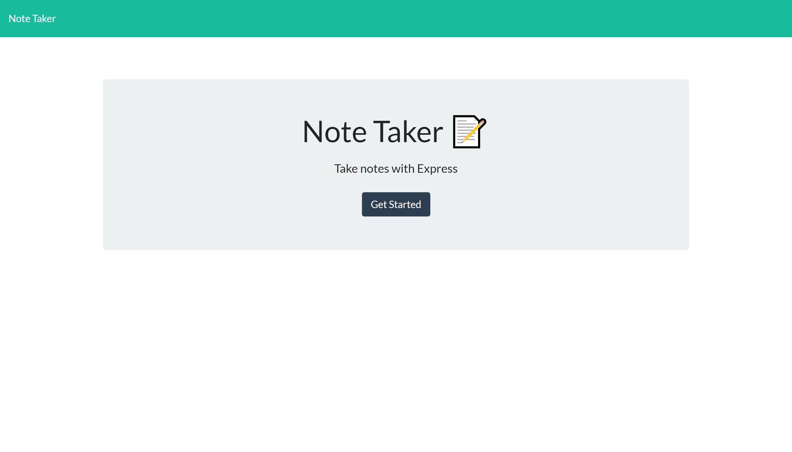

# HW 11-Express.js-Note-Taker
  

  # Table of Contents       

* [License](#license)

 * [Description](#description)
 * [Usage](#usage)
 * [Test](#test)
 * [Installation](#installation)
 * [Author](#author)
 * [Contributors](#contributors)
 * [Contact](#contact)
 * [Link](#link)
 
## License
    
    This project is licensed under the MIT
 
 ## Description:
 * This app allows you to make notes with a title and text. You can add new notes or delete old notes.
 
 ## Usage:
 * Make reminders for yourself and  delete the note as you complete your personal tasks.
 
 ## Test:
  * Currently, there is no test available.
 
 
 ## Installation:
 * You can access this app on Heroku. The link is at the bottom of the page.
 
 ### Author:
  Rebecca Lacer 
 
 
 ### Contributors:
  n/a
 
 
 ### Contact
 
* Github: https://github.com/RLacer
* Email: r.a.lacer@hotmail.com

### Link
Deployed page on Heroku: https://damp-lake-21717.herokuapp.com/

#### Screenshot

<footer>This readme was generated using my homework assignment 9, Node.js readme generator.🏫</footer>